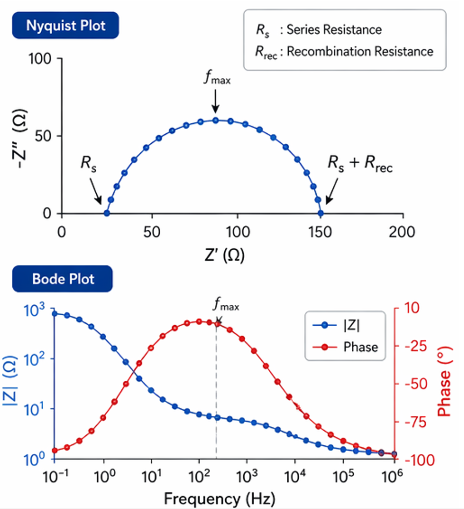
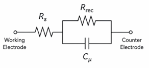

# Electrochemical Impedance Spectroscopy (EIS)

Electrochemical Impedance Spectroscopy (EIS) is a **frequency-domain characterization technique** widely used to investigate charge transport, recombination, and interfacial processes in photovoltaic devices. In solar-cell research, EIS provides a non-destructive method to separate the different electrical contributions that determine device performance, including series resistance, transport resistance, chemical capacitance, and recombination kinetics.

Unlike steady-state current–voltage measurements, EIS resolves these processes over a broad frequency range, allowing the scientist to distinguish fast interfacial phenomena from slower transport and diffusion mechanisms. It is therefore a routine tool in the characterization of **silicon, thin-film, dye-sensitized, organic, and perovskite solar cells**. 

---

## Principle of the Measurement

In an EIS experiment, the device is perturbed with a small sinusoidal voltage signal superimposed on a chosen DC operating point:
$$
V(t)=V_{\mathrm{DC}}+\Delta V \sin(\omega t)
$$

where:

* $V_{\mathrm{DC}}$ is the bias voltage
* $\Delta V$ is the AC perturbation amplitude
* $\omega = 2\pi f$ is the angular frequency

The resulting current response is also sinusoidal but generally phase-shifted:
$$
I(t)=I_0 \sin(\omega t+\phi)
$$
The phase shift $\phi$ arises from capacitive and transport-related processes inside the photovoltaic device.

The complex impedance is then defined as
$$
Z(\omega)=\frac{\tilde{V}(\omega)}{\tilde{I}(\omega)}
$$
where $\tilde{V}$ and $\tilde{I}$ are the complex voltage and current phasors.

This quantity is frequency-dependent and can be written as a complex number
$$
Z(\omega)=Z'(\omega)+jZ''(\omega)
$$
with:

* $Z'$: real component (resistive contribution)
* $Z''$: imaginary component (capacitive / inductive contribution)

---

## Measurement Routine

The EIS routine is typically performed after the device has reached a stable operating state under dark or illuminated conditions.

First, the photovoltaic device is biased at the desired operating point. Common measurement conditions include:

* open-circuit voltage ($V_{oc}$)
* short-circuit condition
* maximum power point
* defined forward bias

A small AC perturbation, typically **5–20 mV**, is then applied to ensure operation in the linear response regime.

The frequency is swept over several orders of magnitude, commonly from mHz to MHz, depending on the device architecture and the physical processes of interest. At each frequency, the instrument records the amplitude ratio and phase difference between voltage and current.

---

## Data Representation

EIS data are commonly presented in **Nyquist** and **Bode** formats.

<figure markdown="span">
  { .on-glb width="80%" }
</figure>

In the **Nyquist** representation, the negative imaginary impedance is plotted against the real impedance. This often produces one or more semicircular arcs, each corresponding to a characteristic time constant. With the diameter of an arc is typically associated with a resistance component.

For photovoltaic devices, a common interpretation is:
$$
R_s + (R_{rec} \parallel C_\mu)
$$
where:

* $R_s$: series resistance
* $R_{rec}$: recombination resistance
* $C_\mu$: chemical capacitance

The Bode representation plots $|Z|(f)$ and $\phi(f)$. which makes the frequency dependence explicit and is particularly useful for identifying characteristic relaxation frequencies.

---

## Equivalent Circuit Analysis

A central part of EIS analysis is fitting the experimental spectrum to an equivalent electrical circuit.

<figure markdown="span">
  
</figure>

For photovoltaic devices, the most frequently used model is the **Randles-type equivalent circuit**:
$$
Z(\omega)=R_s+\frac{R_{ct}}{1+j\omega R_{ct}C}
$$
This model describes:

* ohmic losses through $R_s$
* interfacial charge-transfer processes through $R_{ct}$
* capacitive storage through $C$

In solar-cell science, the charge-transfer resistance is often replaced by recombination resistance:
$$
R_{ct}\rightarrow R_{rec}
$$
to reflect electron–hole recombination processes at interfaces or within the absorber layer.

For non-ideal capacitive behavior, a **constant phase element (CPE)** is frequently used:  
$$
Z_{\mathrm{CPE}}=\frac{1}{Q(j\omega)^n}
$$
where $0<n<1$.

This accounts for distributed time constants caused by interfacial roughness, trap states, or inhomogeneous transport. ([ACS Publications][1])

---

## Key Physical Parameters

From EIS fitting, several physically meaningful parameters can be extracted.

The recombination lifetime is commonly estimated from the characteristic frequency at the peak phase response:
$$
\tau = \frac{1}{2\pi f_{\max}}
$$
This is one of the most important quantities in photovoltaic research, as it provides direct insight into carrier lifetime under operating conditions.

Similarly, the RC time constant is given by
$$
\tau = RC
$$
which describes transport and charge accumulation processes. An increase in $R_{rec}$ generally indicates suppressed recombination and improved open-circuit voltage. A decrease in $R_s$ is often correlated with improved fill factor.