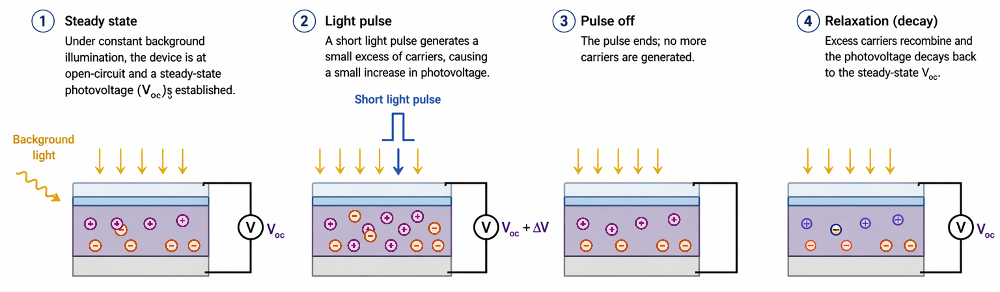
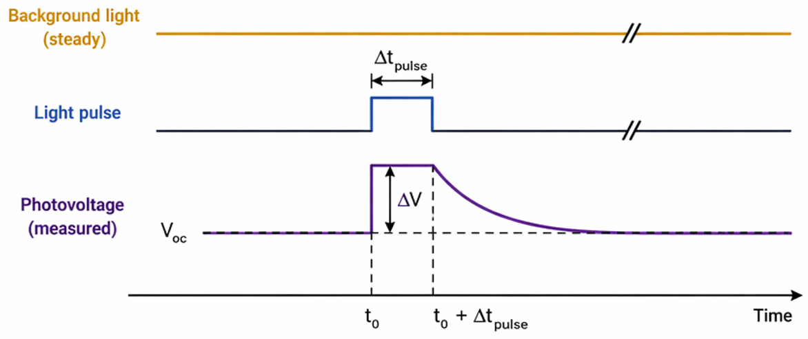

# Transient Photo Response

Transient techniques such as [Transient Photovoltage (TPV)](#transient-photovoltage-tpv) and [Transient Photocurrent (TPC)](#transient-photocurrent-tpc) provide insight into the dynamic behavior of charge carriers in photovoltaic devices. Unlike steady-state measurements, these methods probe how the system responds to small perturbations in illumination, allowing the separation of recombination and charge transport/extraction processes. Together, TPV and TPC form a complementary toolkit to understand the physical mechanisms that ultimately govern device performance and efficiency.

In short:  
TPC → charge extraction dynamics  
TPV → recombination lifetime  

## Transient Photovoltage (TPV)

The **Transient Photovoltage (TPV)** technique is a time-resolved method used to probe the **recombination dynamics** of charge carriers in photovoltaic devices. Unlike steady-state measurements such as JV curves, TPV provides direct insight into how long photogenerated carriers persist before recombining, making it particularly powerful for understanding carrier lifetime under operating conditions.

<figure markdown="span">
  { .on-glb width="80%" }
</figure>

At its core, TPV measures how the open-circuit voltage (Voc) of a device decays after a small perturbation in illumination. The solar cell is first held under a constant background light, establishing a steady-state carrier population and a corresponding Voc. A short light pulse (typically from a laser or LED) is then applied, generating a small excess of carriers. This causes a slight increase in Voc.

Once the pulse ends, no additional carriers are generated, and the system relaxes back to equilibrium. The measured signal is the temporal decay of the photovoltage, which reflects how quickly the excess carriers recombine. Because the device remains in open-circuit conditions, no current flows, ensuring that the decay is governed purely by recombination processes, not extraction.

<figure markdown="span">
  { .on-glb width="80%" }
</figure>

!!!info "Small perturbation"
    A key aspect of TPV is that the perturbation must remain **small** relative to the steady-state carrier density. This ensures that the system stays in the linear response regime, where the decay dynamics represent the intrinsic recombination behavior at that operating point. By varying the background illumination, one can map how the carrier lifetime depends on carrier density, which is essential for identifying recombination mechanisms such as bimolecular or trap-assisted recombination.

### Data fitting

In practice, the photovoltage decay often follows an approximately exponential behavior, and the characteristic decay time constant is interpreted as the effective carrier lifetime ($\tau$). However, in real devices (especially perovskites or organic photovoltaics) the decay can deviate from a single exponential due to disorder, trap states, or multiple recombination pathways, and more advanced analysis may be required.

## Transient Photocurrent (TPC)

The Transient Photocurrent (TPC) technique is a complementary time-resolved method to TPV, designed to probe the charge extraction dynamics in photovoltaic devices. While TPV isolates recombination under open-circuit conditions, TPC focuses on how quickly photogenerated carriers are transported and collected when the device is held under short-circuit conditions.

In a TPC experiment, the photovoltaic device is held under short-circuit conditions (or near-zero applied bias) and excited with a short optical pulse generated by a pulsed laser or LED source. The light pulse creates a population of electron-hole pairs inside the active layer. These carriers are then driven toward the electrodes by the built-in electric field and any diffusion gradients present in the device.

The resulting extraction current is recorded as a function of time:
$$
I(t) = I_0 e^{-t/\tau}
$$

where:  
$I_0$ = initial extracted current  
$\tau$ = characteristic extraction time constant

Though for many real devices, the response is multi-exponential:
$$
I(t)=\sum_i A_i e^{-t/\tau_i}
$$

### Charge Extraction
The total extracted charge is obtained by integrating the transient:
$$
Q=\int I(t) dt
$$

This quantity corresponds to the number of photogenerated carriers successfully collected at the electrodes.

It is often used to compare:

* generated charge
* extracted charge
* recombination losses

--8<-- "includes/abbreviations.md"

