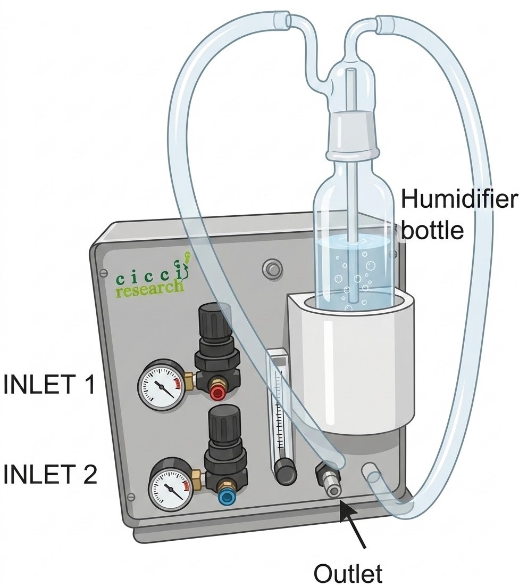
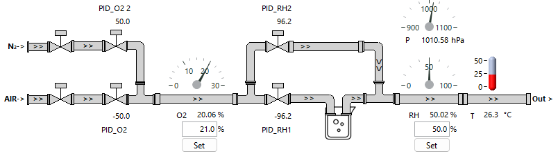

<figure markdown="span">
  { width="300" }
</figure>

The **Arkeo Air Unit** provides precise control of the gas environment used during measurements. It enables real-time adjustment of:

* Gas composition (e.g. O₂ / N₂ ratio)
* Humidity
* Temperature

All parameters are regulated by an embedded real-time controller, ensuring stable and reproducible conditions.

---

## Operating Principle

The air unit operates in three main stages:

### 1. Gas Mixing

The system accepts two input gases (e.g. ambient air and pure N₂).

Each inlet is controlled by a regulated valve, allowing the system to mix the gases dynamically.
By adjusting the flow ratio, the desired **oxygen concentration** is achieved.

### 2. Humidity Control

The gas mixture is then directed into a **bubbler**, where it becomes fully humidified.

To achieve the target humidity level, a portion of the gas is humidified through the bubbler. A second portion bypasses the bubbler (dry gas). The two streams are mixed to reach the desired **relative humidity**

### 3. Temperature Control (Optional)

An optional heating module can be installed downstream of the gas mixing stage.

This allows the gas temperature to be increased to a defined setpoint before reaching the measurement chamber.

---

## Control System

All parameters (gas composition, humidity, temperature) are continuously monitored and adjusted by the internal controller, enabling:

* Fast response to setpoint changes
* Stable long-term operation
* Real-time configuration via software