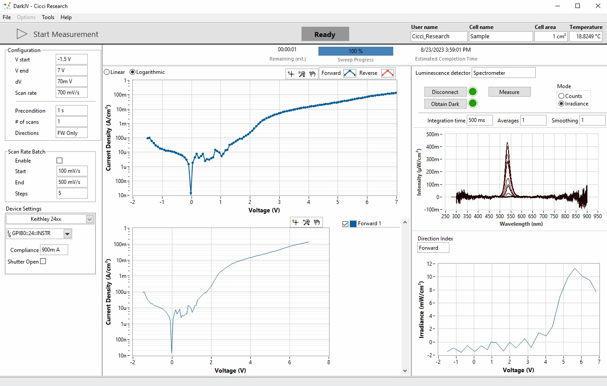

In the Dark JV routine, a voltage sweep is applied on the device in forward and/or reverse direction. The scan can be automatically repeated at different scan rates. The device can be preconditioned before starting any measurement to allow for the device to relax to a steady state.

In addition, a spectrometer or photodiode can measure the electroluminescence in parallel. By dividing this signal by the current at which the signal was applied, the total EQE can be calculated.

## Measurement
The Dark JV routine applies a staircase voltage sweep. At each voltage applied, a delay of 25% of the point time (step size / scan rate) is applied before measuring to avoid measure any transient effects. At the direction change, the last voltage point is applied twice. e.g. ..., 0.8, 0.9, 1.0 --> 1.0, 0.9, 0.8, ...

The data is plotted on an IV graph. By defaul the current axis is on a logarithmic scale to highlight the different regions of the scan. The current is plotted as absolute values, so any negative currents are shown as well.

### Electroluminescence
By adding a photodetector such as a photodiode or spectrometer, the electroluminescence (EL)signal of a device as a function of applied voltage can be measured. Select the appropriate photodetect from the drop-down menu and start the measurement as normal. Now the EL signal will automatically be measured and saved in parallel. Note that the electrical scan runs independently from the photodetector scan. If the acquisition time of the photodetector is longer than the point time of electrical scan, multiple voltage points can be measured.

If the photodetector is calibrated (i.e. an irradiance in W is obtained), the signal can be converted to an EQE. Note that this EQE is total efficiency, not wavelength dependent. Moreover, this is an EL-EQE (or external radiative efficiency (ERE)), not a standard EQE as measured with [IPCE](../../../scientific/scientific-ipce.md).
$$
\text{EQE} = \frac{\text{emitted photons per seconds}}{\text{injected electrons per second}}
$$
With
$$\text{emitted photons per seconds} = I/q$$
and
$$\text{injected electrons per second}=\int{\frac{E(\lambda)\lambda}{hc}d\lambda}$$

## Settings

The following settings are available for the Dark JV routine

| Parameter  | Description                       | Value                                                                        | Unit |
| ---------- | --------------------------------- | ---------------------------------------------------------------------------- | ---- |
| Start      | Start of the scan                 | -0.2                                                                         | V    |
| End        | End of the scan                   | 1.2                                                                          | V    |
| Step       | Voltage step between points       | 0.02                                                                         | V    |
| Scan rate  | How fast the voltages are applied | 0.2                                                                          | V/s  |
| Scan order | Order of the scans                | Forward then Reverse Reverse then Forward Forward Only Reverse Only |      |
| Precondition   | Hold the first point before starting the scan | 1                                          | s    |
| Turn Hold | Hold the last point before changing direction          | -1                                         |      |

### Parameter Sweep

The Parameter Sweep module allows automated execution of multiple measurements by varying selected parameters.

This module is shared across multiple routines.

See: [Parameter Sweep Module](../../software/parameter-sweep.md){ data-preview }

