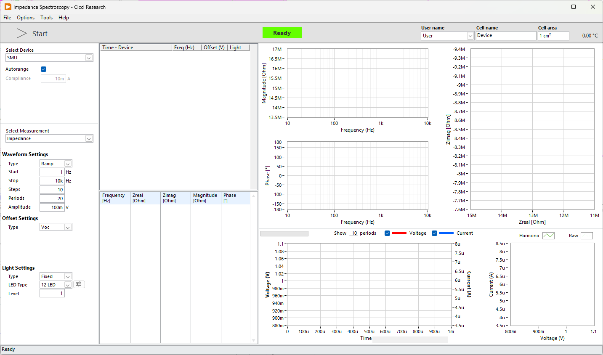

<!-- 

 -->

## Overview

Electrochemical Impedance Spectroscopy (EIS) determines the complex impedance of a device by applying a small sinusoidal voltage perturbation and measuring the resulting current response. In ARKEO, EIS is implemented using the same core acquisition and signal-processing engine that is also used for IMPS and IMVS. The excitation source changes between routines, but the mathematical treatment and data structure remain the same.

---

## Measurement Principle

A sinusoidal voltage is applied to the device:
$$
V(t) = V_{offset} + V_{AC} \cdot \sin(2\pi f t)
$$
where:

* $V_{offset}$ is the DC bias voltage
* $V_{AC}$ is the AC amplitude
* $f$ is the excitation frequency

The device responds with a current signal:
$$
I(t) = I_{AC} \cdot \sin(2\pi f t + \phi)
$$
Because the device behaves as a complex impedance, the current is phase-shifted by an angle φ relative to the applied voltage.

---

## Signal Processing and Impedance Calculation

For each frequency point, voltage and current are acquired simultaneously in the time domain. A Fourier Transform is then applied to both signals to extract the fundamental frequency component. The software then extracts the **amplitude** of the voltage and current signals, as well as their **phases**. The fundamental frequency identified in the Fourier spectrum should match the applied excitation frequency. Any deviation can indicate synchronization issues or non-linear effects.

The complex impedance is the calculated as:
$$
Z(f) = \frac{V(f)}{I(f)}
$$
From this quantity, ARKEO computes:

* The impedance magnitude $|Z|$
* The phase difference between voltage and current
* The real part $Z'$
* The imaginary part $Z''$

These values are stored for each frequency and used for graphical representation.

---

## Generated Visualizations

For every frequency sweep, several complementary representations are produced.

The **Bode diagram** displays the impedance magnitude and phase as a function of frequency on a logarithmic axis. This representation is useful for identifying characteristic time constants and frequency-dependent behavior.

The **Nyquist diagram** represents the imaginary component of the impedance versus the real component. This is particularly useful for identifying resistive and capacitive contributions and for equivalent circuit modeling.

In addition to frequency-domain plots, the raw **time-domain sine waves** are shown. The applied voltage and measured current can be inspected directly to verify signal quality and stability. A **Lissajous** plot, representing current versus voltage, is also generated. This visualization is valuable for assessing linearity and detecting distortion or noise in the measurement.

---

## Voltage Offset Sweep

EIS can be performed at a single DC operating point (user-set or Voc) or across multiple bias voltages.

When a fixed offset is selected, the entire frequency sweep is performed at that specific DC bias. Alternatively, the user can define a series of voltage offsets. In this case, the complete frequency sweep is repeated for each offset value, in a manner analogous to the parameter sweep module.

This allows the impedance to be studied as a function of operating voltage, enabling analysis of recombination dynamics, differential resistance, and transport behavior under realistic working conditions.

---

## Bias Light Sweep

The routine also supports illumination-dependent measurements. A defined bias light level can be applied during the EIS measurement, and multiple light intensities can be specified.

For each light level, the system performs the defined voltage offset sequence, and for each offset, the full frequency sweep is executed. The resulting data structure therefore reflects the hierarchical nature of the experiment: illumination level, voltage bias, and frequency.

This configuration enables comprehensive characterization of the device under realistic operating conditions, combining electrical bias and optical excitation in a controlled and repeatable way.

---

## Relation to IMPS and IMVS

EIS shares its internal architecture with IMPS and IMVS. In all three routines, the same frequency sweep engine, stabilization logic, Fourier analysis, and complex quantity extraction are used. The difference lies only in the excitation and measured variable.

In EIS, a sinusoidal voltage is applied and the current response is measured. In IMPS and IMVS, the perturbation is optical rather than electrical, and either current or voltage is measured depending on the specific technique. Despite these differences in excitation, the mathematical treatment of amplitude, phase, and complex representation remains identical.

This unified approach ensures consistency across impedance-related measurements and simplifies comparison between EIS, IMPS, and IMVS results.