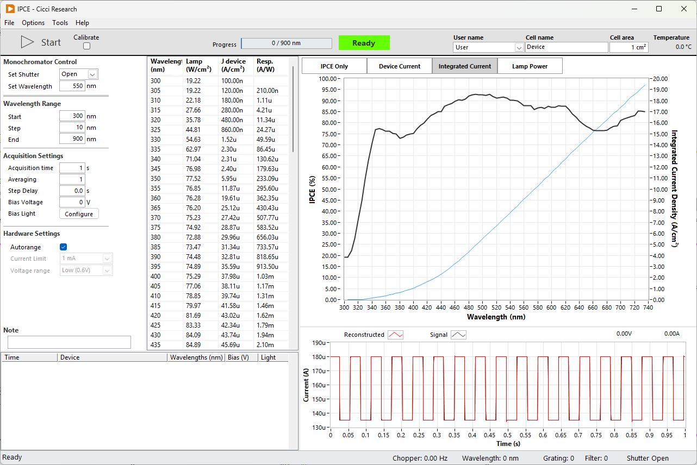

In the IPCE routine, monochromatic light is sequentially applied to the device while the generated photocurrent is measured at each wavelength. Using the calibrated lamp power and device current, the Incident Photon-to-Current Efficiency (IPCE), also referred to as External Quantum Efficiency (EQE), is calculated for every wavelength step.

The routine allows precise control over wavelength range, acquisition timing, bias conditions, and hardware configuration. During the scan, the IPCE curve is displayed in real time together with device current and integrated current.

The IPCE routine follows the following order of operations:

1. Start
2. Open shutter
3. Move monochromator to start wavelength
4. Stabilize signal
5. Measure device current
6. Calculate IPCE
7. Move to next wavelength

!!! warning "Lamp Calibration"
    Every time the lamp is turned on, and after each 2 hours, it is recommended to calibrate the lamp power. See [Lamp Calibration](#lamp-calibration).

---

## Chopper
To improve the signal-to-noise ratio, a chopper can be introduced between the light source and the device. As the frequency of the chopped light is known, the noise can be filtered out by just considering the signal at this known frequency. In practice, a Fourier Transform is applied to extract this amplitude. This procedure is especially powerful when the input light intensity is very low (for example in the UV in case of a Xenon arc light) or when the signal from the device is very low (for example, when the wavelength exceeds the bandgap).

### Chopped light considerations
Although using chopped light can improve the signal-to-noise ratio, it comes with some limtations that have to be considered.

*Acquisition Time*
To properly calculate the Fourier Transform, it is recommended to provide at least 10 periods. The acquisition time at each wavelength must be selected according to the set frequency

*Device Response*
Some devices, especially DSSCs, have very slow transient responses. Sometimes in the order of seconds. If the frequency of the chopped light is faster than the transient response of the device, the current isn't allowed to saturate and the EQE can be underestimated. 

---

## Settings

The following settings are available for the IPCE routine

### Manual Monochromator Control

Control the monochromator with these controls independent of the measurement. These controls are disabled during a measurement.

| Parameter      | Description                   | Value | Unit |
| -------------- | ----------------------------- | ----- | ---- |
| Set Shutter    | Open or close optical shutter | Open  |      |
| Set Wavelength | Manual wavelength positioning | 550   | nm   |

### Wavelength Range

| Parameter | Description                   | Value | Unit |
| --------- | ----------------------------- | ----- | ---- |
| Start     | Start wavelength of the scan  | 300   | nm   |
| Step      | Step size between wavelengths | 10    | nm   |
| End       | End wavelength of the scan    | 900   | nm   |

### Acquisition Settings

| Parameter        | Description                             | Value | Unit |
| ---------------- | --------------------------------------- | ----- | ---- |
| Acquisition time | Integration time per wavelength         | 1     | s    |
| Averaging        | Number of averaged measurements         | 1     |      |
| Step Delay       | Delay between wavelength steps          | 0     | s    |
| Bias Voltage     | Applied voltage during IPCE measurement | 0     | V    |
| Bias Light       | Configure bias illumination             |       |      |

### Hardware Settings

| Parameter     | Description                         | Value |
| ------------- | ----------------------------------- | ----- |
| Autorange     | Automatically select current range  | true  |
| Current Limit | Maximum allowed measurement current | 1 mA  |

---

## Lamp Calibration
Every time the lamp is turned on, and after each 2 hours, it is recommended to calibrate the lamp power. To calibrate the lamp, check the "Calibrate" checkbox and start the measurement as normal. You are then asked to provide the photodiode calibration file. A default file is selected automatically. 

The system will then sweep through the selected wavelengths and record the current from the photodiode. The lamp power is then calculated as 
$$
P_{lamp}(W/cm²) = I_{ph}(A/cm²) / \text{responsivity} (A/W)
$$
After the calibration, the result is saved to a file at `C:\Arkeo\calibration\IPCE Lamp Power.txt`. A copy is also created `C:\Arkeo\calibration\IPCE Calibration History`. All measurements use the latest calibration file to calculated the EQE.

## Data Display

During the measurement, the interface provides:

* Real-time IPCE curve
* Device current versus wavelength
* Integrated current
* Lamp power monitoring
* Time-domain chopped signal visualization

The lower panel displays the raw chopped photocurrent signal used for lock-in style reconstruction of the IPCE value.

