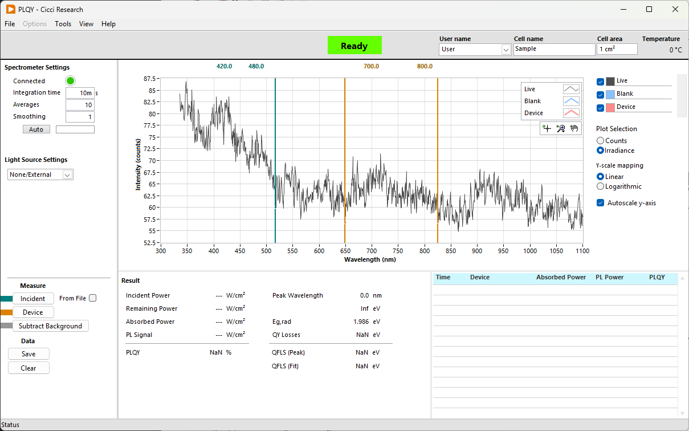
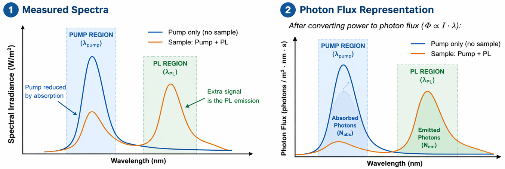

Compare how many photons are **absorbed from the pump** vs how many photons are **reemitted as PL**.

Spectra are in **W/m² (power density)**, but **PLQY is a photon ratio**, so you must convert **power → photon flux**.
$$
\Phi(\lambda) = \frac{I(\lambda)}{hc/\lambda} = \frac{I(\lambda) \cdot \lambda}{hc}
$$

$$
\boxed{
\text{PLQY} = \frac{N_\text{emitted}}{N_\text{absorbed}}
} = 
\boxed{
\text{PLQY} =
\frac{
\sum_{\text{PL}} \left( I_\text{sample} - I_\text{pump} \right) \lambda \Delta\lambda
}{
\sum_{\text{pump}} \left( I_\text{pump} - I_\text{sample} \right) \lambda \Delta\lambda
}
}
$$

<figure markdown="span">
  { .on-glb width="100%" }
</figure>

---
 
Let:

* $I_\text{pump}(\lambda)$ = pump-only spectrum
* $I_\text{sample}(\lambda)$ = pump + PL (with reduced pump)

Then:
$$
\text{PLQY} =
\frac{
\int \frac{I_\text{sample}(\lambda) - I_\text{pump}(\lambda)}{hc/\lambda} \cdot d\lambda
}{
\int \frac{I_\text{pump}(\lambda) - I_\text{sample}(\lambda)}{hc/\lambda} \cdot d\lambda
}
$$

Split into **two wavelength regions**:

### 1. Emitted photons (PL region)
(typically longer wavelengths than pump)

$$
N_\text{emitted} =
\int_{\text{PL region}} \frac{I_\text{sample}(\lambda) - I_\text{pump}(\lambda)}{hc/\lambda} d\lambda
$$

---

### 2. Absorbed photons (pump region)

$$
N_\text{absorbed} =
\int_{\text{pump region}} \frac{I_\text{pump}(\lambda) - I_\text{sample}(\lambda)}{hc/\lambda} d\lambda
$$

This measures how much pump light disappeared (absorbed).
