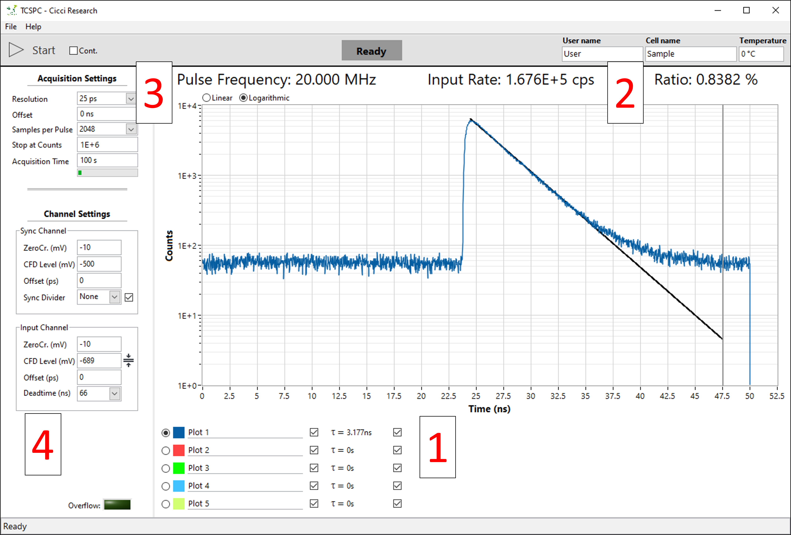
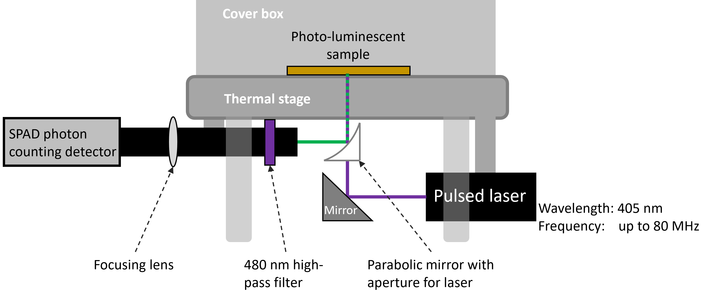
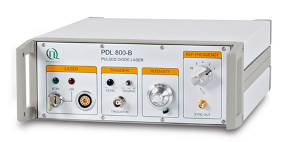
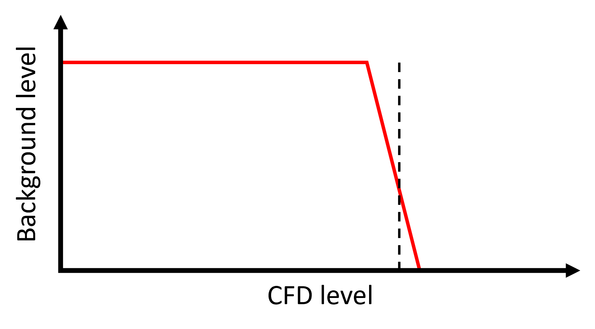
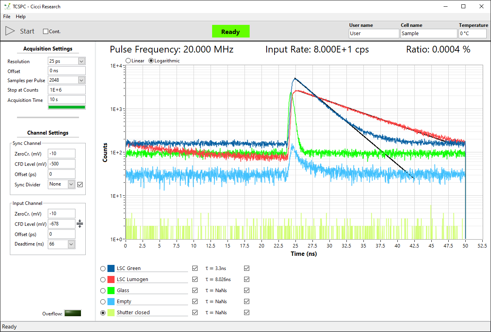
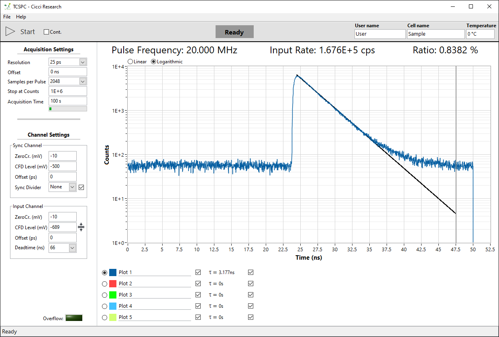
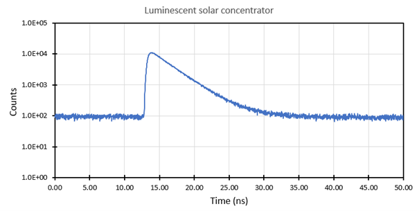
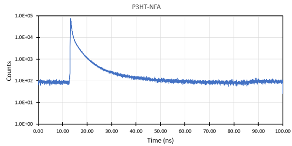

# Transient photoluminescence  

## Main Interface

The main interface is shown when the software is launched.  

The main interface consists of:

1. Graph showing photons counts vs time delay (ns)  
   a. Graph selection shown under the graph for multiple acquisitions  

2. Rate:  
   a. Pulse frequency – Frequency of the laser pulses  
   b. Input Rate – photon count (counts per second)  
   c. Ratio – Ratio of the two above values  

3. Acquisition settings for changing how long the measurement takes  

4. Channel settings for fine tuning signal strength  

---

## Basics & hardware setup

Time correlated single photon counting (TCSPC) is a technique used to measure the photoluminescence decay of a luminescent sample. When such a sample is illuminated, some photons excite electron in the sample to the conductance band. After lowering their energy by falling to a lower energy band, the electrons may fall back to the valence electron band and, in the process of doing so, emit a photon. The time that it takes between absorbing a photon and re-emitting a photon is not constant. It follows an exponential decay curve. Mostly emitting just after the absorption and less and less as time passes.  

To measure this decay, the simplest way is to measure the current of a fast photodiode, which corresponds linearly to the light intensity. However, many materials have a decay time in the order of nanoseconds. This requires both very fast photodiodes and very fast electronics.  

TCSPC takes another approach by not acquire a single snapshot of the entire decay curve but pulsing the device at weaker illumination and measuring the time delay between the pulse and an emitted photon. The time delay follows the same exponential distribution as the single snapshot curve described above. By repeating this millions of times, the same exponential decay curve can be acquired. The advantage of this method is that time delays between two digital signals (laser output and detector output) can be very accurately timed (picosecond resolution) resulting in highly resolved decay curves.  

---

## Software guide

### Main graph

5 graphs can be displayed simultaneously. Below the graph you can:

- Set the graph name  
- Show/hide the graph  
- See the time constant  
- Show/hide the fit curve  

Each graph can be individually fitted using a mono-exponential decay.  

The graph is fitted between its maximum and the cursor. Each graph has a gray vertical cursor that can be dragged to select the fitting region.  

---

### Rates

The program always displays the live rates from both the laser and the photon detector. The laser frequency can be adjusted manually from the laser driver.  

From left to right:  

- Laser  
- Key to turn the laser on/off  
- Laser output  
- External Trigger (unused)  
- Laser intensity  
- Frequency divider – Divides the base 80 MHz (or 1 MHz) frequency according to the below table  

#### 80 MHz base / 1 MHz base

| Divider | Frequency (MHz) | Period (ns) | Frequency (kHz) | Period (µs) |
|--------|----------------|-------------|-----------------|-------------|
| 1      | 80             | 12.5        | 1000            | 1           |
| 2      | 40             | 25          | 500             | 2           |
| 4      | 20             | 50          | 250             | 4           |
| 8      | 10             | 100         | 125             | 8           |
| 16     | 5              | 200         | 62.5            | 16          |
| 32     | 2.5            | 400         | 31.25           | 32          |

A trade-off always must be made when deciding the frequency of the laser. Higher frequencies greatly reduce the measurement time since more photons per second can be acquired resulting in a higher signal-noise ratio. However, this also reduces the pulse period. If the decay of your device is longer than the period of the laser pulse, the measurement may show artifacts (photons from previous pulses showing in next pulses). Moreover, the entire decay curve will not be acquired.  

---

### Input Rate

The photon detector input rate is always showing the live detection in counts per second. This rate should be carefully controlled. Having an input ratio that is too low reduces the signal-noise ratio (while increasing measurement time). Too high however may negatively affect the measurement by the effect of pile-up.  

A general rule-of-thumb is to keep the ratio of input/output around 1%. Adjust the laser intensity to tune the ratio.   

---

### Acquisition settings

In this section you can change how the signal is acquired.

| Parameter | Description |
|----------|------------|
| Resolution | Width of the histogram bins. Lower the resolution for a higher signal-noise ration at the cost of loss of detail. |
| Offset | Offset from where to acquire the pulse. Delays in the system will generally offset the pulse from t = 0s. Use the offset to pulse. |
| Samples per Pulse | Number of histogram bins. Resolution x samples > pulse period to not lose any photons. Any bins that come after the pulse period will show 0. |
| Stop at Counts | Stop the measurement once a certain number of total photons are counted. Useful for comparing measurements. |
| Acquisition Time | Maximum time to acquire a signal. |

---

### Channel settings

These settings are hardware dependent and should not be changed if the hardware isn’t changed. The only important parameter is the CFD Level of the Input Channel.  

Below is a figure showing a typical train of voltages from the photon detector (photon pulses are negative). The red line shows the CFD level which acts as a cut-off for detecting pulses from desired voltages. The detector always has a background voltage due to stray light or thermal excitation.  

A CFD level of -687 mV is a good starting point for a measurement. Should the signal of the device be very weak, the CFD level can be lowered in steps of -1 mV until a peak is detected. This will come at the cost of picking up more background noise. This will result in a horizontal line superimposed on the actual signal peak. Since this is a flat line, the cut-off for the background is very sharp (see the graph below).  

This cut-off level can be found by turning off the laser and changing the CFD level 1 mV at a time until the input rate reads < 100 cps. This is a good starting point for acquiring a signal. If still no fluorescence signal is read, it’s possible that the signal is very weak and near the noise level. Take note if the ratio value changes when turning the laser on/off.  

---

### Instrument Response Function

In addition to the background noise, the entire system itself has a certain base response (Instrument Response Function or IRF). This response is hardware dependent and is most affected by the detector and the excitation source. The IRF is displayed as a narrow peak and should always be included in a good TCPSC measurement.  

The IRF can be acquired by simply inserting piece of glass (or nothing at all) in place of the device. The IRF indeed affects the response of the device. Though since the IRF is generally a small peak, the measurement is affected only in the beginning.  

---

## Example measurements

A luminescent solar concentrator showing a mono-exponential decay with an estimated lifetime of around 2.9 ns.  

A layer of P3HT-NFA deposited on a flexible plastic showing a bi-exponential decay.  

---